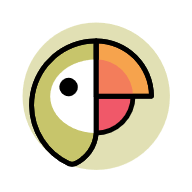
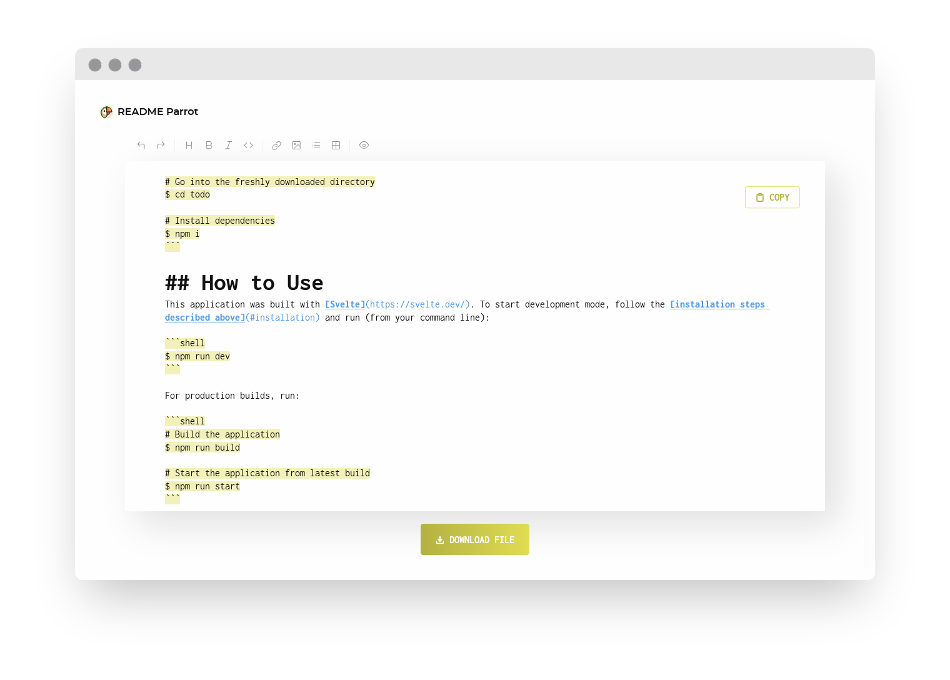

<div align="center">



# README-Parrot

#### A simple little [README template](https://www.lenaschnedlitz.me/readme-parrot). Aren't all your READMEs kind of the same?

[](https://svelte.dev/)
[](https://github.com/LenaSchnedlitz/readme-parrot)
[]()
[](https://www.lenaschnedlitz.me/readme-parrot)
[](#license)

[Key Features](#key-features) · [Installation](#installation) · [How to Use](#how-to-use) · [Contributing](#contributing) · [License](#license)



</div>

## Key Features

README-Parrot provides a simple template for your side project READMEs. [Try it out!](https://www.lenaschnedlitz.me/readme-parrot)

## Installation

To clone and run this application, you need [Git](https://git-scm.com) and [npm](https://npmjs.com).
Run from your command line:

```shell
# Clone the repository
$ git clone git@gitlab.com:LenaSchnedlitz/readme-parrot.git

# Go into the freshly downloaded directory
$ cd readme-parrot

# Install dependencies
$ npm i
```

## How to Use

This application was built with [Svelte](https://svelte.dev/). To start development mode, follow the [installation steps described above](#installation) and run (from your command line):

```shell
$ npm run dev
```

For production builds, run:

```shell
# Build the application
$ npm run build

# Start the application from latest build
$ npm run start
```

## Contributing

Merge requests and bug reports are welcome. I will try my best to process them as soon as possible, but please be patient - my spare time is (sadly) very limited.

## License

[MIT](LICENSE) · Credits are much appreciated :heart:
